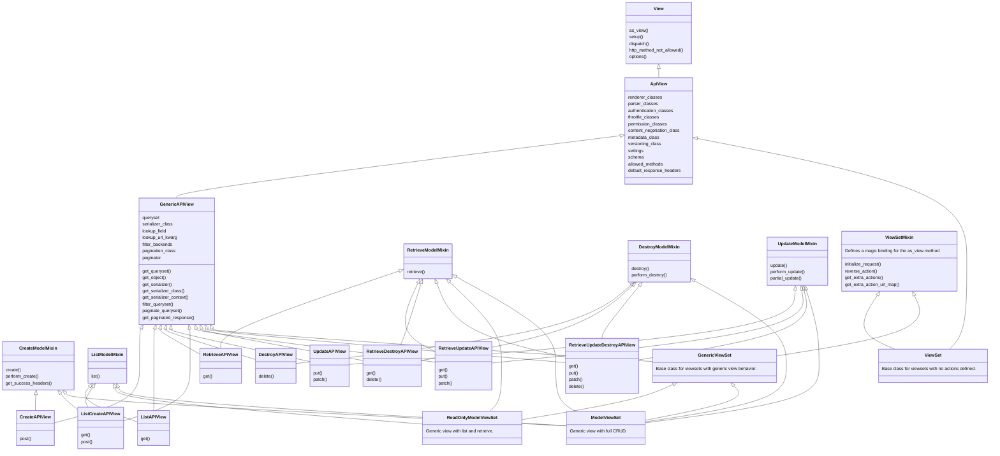

```mermaid
classDiagram

View <|-- ApiView

ApiView <|-- GenericAPIView

CreateModelMixin <|-- CreateAPIView
GenericAPIView <|-- CreateAPIView

ListModelMixin <|-- ListAPIView
GenericAPIView <|-- ListAPIView

RetrieveModelMixin <|-- RetrieveAPIView
GenericAPIView <|-- RetrieveAPIView

DestroyModelMixin <|-- DestroyAPIView
GenericAPIView <|-- DestroyAPIView

UpdateModelMixin <|-- UpdateAPIView
GenericAPIView <|-- UpdateAPIView

ListModelMixin <|-- ListCreateAPIView
CreateModelMixin <|-- ListCreateAPIView
GenericAPIView <|-- ListCreateAPIView

RetrieveModelMixin <|-- RetrieveUpdateAPIView
UpdateModelMixin <|-- RetrieveUpdateAPIView
GenericAPIView <|-- RetrieveUpdateAPIView

RetrieveModelMixin <|-- RetrieveDestroyAPIView
DestroyModelMixin <|-- RetrieveDestroyAPIView
GenericAPIView <|-- RetrieveDestroyAPIView

RetrieveModelMixin <|-- RetrieveUpdateDestroyAPIView
UpdateModelMixin <|-- RetrieveUpdateDestroyAPIView
DestroyModelMixin <|-- RetrieveUpdateDestroyAPIView
GenericAPIView <|-- RetrieveUpdateDestroyAPIView

ViewSetMixin <|-- ViewSet
ApiView <|-- ViewSet

GenericAPIView <|-- GenericViewSet
ViewSetMixin <|-- GenericViewSet

RetrieveModelMixin <|-- ReadOnlyModelViewSet
ListModelMixin <|-- ReadOnlyModelViewSet
GenericViewSet <|-- ReadOnlyModelViewSet

CreateModelMixin <|-- ModelViewSet
RetrieveModelMixin <|-- ModelViewSet
UpdateModelMixin <|-- ModelViewSet
DestroyModelMixin <|-- ModelViewSet
ListModelMixin <|-- ModelViewSet
GenericViewSet <|-- ModelViewSet

View : as_view()
View : setup()
View : dispatch()
View : http_method_not_allowed()
View : options()

ApiView : renderer_classes
ApiView : parser_classes
ApiView : authentication_classes
ApiView : throttle_classes
ApiView : permission_classes
ApiView : content_negotiation_class
ApiView : metadata_class
ApiView : versioning_class
ApiView : settings
ApiView : schema
ApiView : allowed_methods
ApiView : default_response_headers

CreateModelMixin : create()
CreateModelMixin : perform_create()
CreateModelMixin : get_success_headers()

ListModelMixin : list()

RetrieveModelMixin : retrieve()

UpdateModelMixin : update()
UpdateModelMixin : perform_update()
UpdateModelMixin : partial_update()

DestroyModelMixin : destroy()
DestroyModelMixin : perform_destroy()

GenericAPIView : queryset
GenericAPIView : serializer_class
GenericAPIView : lookup_field
GenericAPIView : lookup_url_kwarg
GenericAPIView : filter_backends
GenericAPIView : pagination_class
GenericAPIView : paginator

GenericAPIView : get_queryset()
GenericAPIView : get_object()
GenericAPIView : get_serializer()
GenericAPIView : get_serializer_class()
GenericAPIView : get_serializer_context()
GenericAPIView : filter_queryset()
GenericAPIView : paginate_queryset()
GenericAPIView : get_paginated_response()

CreateAPIView : post()

ListAPIView : get()

RetrieveAPIView : get()

DestroyAPIView : delete()

UpdateAPIView : put()
UpdateAPIView : patch()

ListCreateAPIView : get()
ListCreateAPIView : post()

RetrieveUpdateAPIView : get()
RetrieveUpdateAPIView : put()
RetrieveUpdateAPIView : patch()

RetrieveDestroyAPIView : get()
RetrieveDestroyAPIView : delete()

RetrieveUpdateDestroyAPIView : get()
RetrieveUpdateDestroyAPIView : put()
RetrieveUpdateDestroyAPIView : patch()
RetrieveUpdateDestroyAPIView : delete()

ViewSetMixin : Defines a magic binding for the as_view method
ViewSetMixin : initialize_request()
ViewSetMixin : reverse_action()
ViewSetMixin : get_extra_actions()
ViewSetMixin : get_extra_action_url_map()

ViewSet : Base class for viewsets with no actions defined.

GenericViewSet : Base class for viewsets with generic view behavior.

ReadOnlyModelViewSet : Generic view with list and retreive.

ModelViewSet : Generic view with full CRUD.
```
